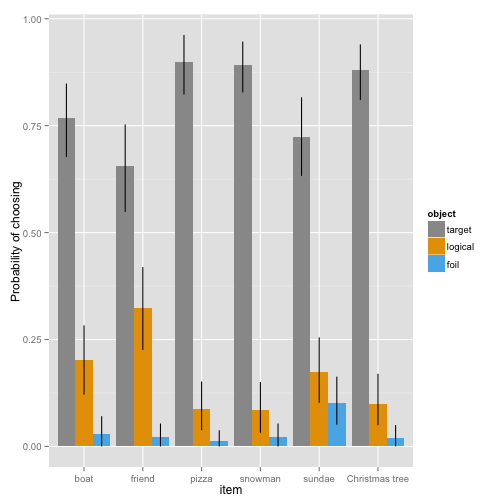
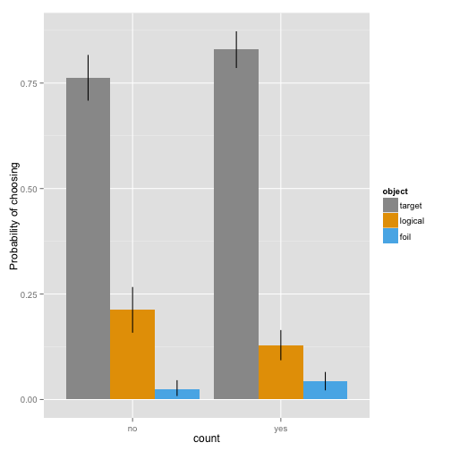

Effect of manipulation check
========================================================

--
title: Effect of manipulation check
author: Andrés Gómez Emilsson
date: December 16th 2013
--


We ran an experiment where particpants were asked to play the (scales, level 1) version of the reference game.

Here we determine how asking participants to count the number of times each feauture ("hat", "mustache", etc.) appears in the present scene (before they do the forced choice task) affects their response. This experiment is done on the simple scales and level 1. I.e. the classical "Bob can only say one word to communicate you and he says '[the feature that appears twice among the referents]'" where the feature he mentions appears twice in the scene. 


```r

setwd("~/Documents/Stanford/Autumn2013-Masters/PayedWork/andres_data")

# When features are requested
with_count <- read.csv("forced_choice_no_fam_6random_count_16_december_ALLS.csv",
                    header=TRUE, sep="\t", row.names=NULL, stringsAsFactors = FALSE)
length(with_count$Answer.choice_correct)
```

```
## [1] 340
```

```r
# Proportion of people counting choosing target
mean(with_count$Answer.choice_correct == "\"TRUE\"")
```

```
## [1] 0.8206
```

```r

# When features are not requested
without_count <- read.csv("forced_choice_no_fam_6random_NOcount_16_december_ALNC.csv",
              header=TRUE, sep="\t", row.names=NULL, stringsAsFactors = FALSE)
length(without_count$Answer.choice_correct)
```

```
## [1] 240
```

```r
# Proportion of people not counting choosing target
mean(without_count$Answer.choice_correct == "\"TRUE\"")
```

```
## [1] 0.7625
```


```r
# All the data pre-procesing. E.g. merging CSV files, adding features from excel sheets, determine if choices were correct
count_compliant <- with_count$Answer.manip_check_target == "\"2\"" & with_count$Answer.manip_check_dist == "\"1\""
with_count_wrong <- subset(with_count,!count_compliant)
with_count <- subset(with_count,count_compliant)

with_count$target <- with_count$Answer.choice=="\"target\""
with_count$logical <- with_count$Answer.choice=="\"logical\""
with_count$foil <- with_count$Answer.choice=="\"foil\""
ms.with_count <- aggregate(cbind(target,
                         logical,
                         foil) ~ 
                     Answer.item, data=with_count, sum)

es_np_with_count <- mean(with_count$target)


without_count$target <- without_count$Answer.choice=="\"target\""
without_count$logical <- without_count$Answer.choice=="\"logical\""
without_count$foil <- without_count$Answer.choice=="\"foil\""

ms.without_count <- aggregate(cbind(target,
                                 logical,
                                 foil) ~ 
                             Answer.item, data=without_count, sum)

es_np_without_count <- mean(without_count$target)
```


```r
# Statistical analysis

with_and_without = rbind(with_count, without_count)

# On its own it is barely significant
summary(aov(target ~  as.factor(Answer.target_position), data = with_and_without))
```

```
##                                    Df Sum Sq Mean Sq F value Pr(>F)  
## as.factor(Answer.target_position)   2    0.9   0.471    2.97  0.052 .
## Residuals                         559   88.7   0.159                 
## ---
## Signif. codes:  0 '***' 0.001 '**' 0.01 '*' 0.05 '.' 0.1 ' ' 1
```

```r


summary(aov(target ~ as.factor(Answer.item) + as.factor(Answer.participant_feature_count_condition) + as.factor(Answer.target_position), data = with_and_without))
```

```
##                                                        Df Sum Sq Mean Sq
## as.factor(Answer.item)                                  5    4.8   0.960
## as.factor(Answer.participant_feature_count_condition)   1    0.8   0.759
## as.factor(Answer.target_position)                       2    0.8   0.409
## Residuals                                             553   83.3   0.151
##                                                       F value  Pr(>F)    
## as.factor(Answer.item)                                   6.37 9.2e-06 ***
## as.factor(Answer.participant_feature_count_condition)    5.04   0.025 *  
## as.factor(Answer.target_position)                        2.71   0.067 .  
## Residuals                                                                
## ---
## Signif. codes:  0 '***' 0.001 '**' 0.01 '*' 0.05 '.' 0.1 ' ' 1
```

```r

# There does not seem to be a statistically significant difference 
contingeny = matrix(data = c(sum(without_count$Answer.choice_correct == "\"TRUE\""), length(without_count$Answer.choice_correct) - sum(without_count$Answer.choice_correct == "\"TRUE\""), sum(with_count$Answer.choice_correct == "\"TRUE\""), length(with_count$Answer.choice_correct) - sum(with_count$Answer.choice_correct == "\"TRUE\"")), nrow = 2)

chisq.test(contingeny)
```

```
## 
## 	Pearson's Chi-squared test with Yates' continuity correction
## 
## data:  contingeny 
## X-squared = 3.426, df = 1, p-value = 0.06416
```


The simple chi square test between the two conditions (independently of other factors) is not significant, but close. 

In any case the effect is very small at best.


```r
# Visualization - the reason this is after statistical analysis is that some properties of the graphs (e.g. a regression line or confidence intervals) are in themselves statistical analysis computed in the previous section

library(plyr)
```

```
## Warning: package 'plyr' was built under R version 2.15.1
```

```r
library(reshape2)
```

```
## Warning: package 'reshape2' was built under R version 2.15.1
```

```r
library(ggplot2)
```

```
## Warning: package 'ggplot2' was built under R version 2.15.2
```

```r
library(binom)
```

```
## Warning: package 'binom' was built under R version 2.15.3
```

```r
library(bootstrap)
```

```
## Warning: package 'bootstrap' was built under R version 2.15.3
```

```r

#colorblind-friendly color palettes
cbPalette <- c("#999999", "#E69F00", "#56B4E9", "#009E73", "#F0E442", "#0072B2", "#D55E00", "#CC79A7")
cbbPalette <- c("#000000", "#E69F00", "#56B4E9", "#009E73", "#F0E442", "#0072B2", "#D55E00", "#CC79A7")


#statistics for boolean factors; copied from useful.R, with a slightly different mean function to work with the choiceCorrect factor
l.mean <- function(...){mean(as.logical(...))}
l.theta <- function(x,xdata,na.rm=T) {l.mean(xdata[x],na.rm=na.rm)}
l.ci.low <- function(x,na.rm=T) {
  l.mean(x,na.rm=na.rm) - quantile(bootstrap(1:length(x),1000,l.theta,x,na.rm=na.rm)$thetastar,.025,na.rm=na.rm)}
l.ci.high <- function(x,na.rm=T) {
  quantile(bootstrap(1:length(x),1000,l.theta,x,na.rm=na.rm)$thetastar,.975,na.rm=na.rm) - l.mean(x,na.rm=na.rm)}


md <- melt(with_and_without, measure.vars = c("target","logical", "foil"), variable.name="object", value.name="chosen")


ms <- ddply(md, .(object, Answer.item),
            summarise, 
            c = mean(chosen),
            n = sum(chosen), 
            l = length(chosen),
            sdc = sd(chosen),
            c.cih = c + l.ci.high(chosen),
            c.cil = c - l.ci.low(chosen))


ms$item <- factor(ms$Answer.item)
levels(ms$item) <- c("boat","friend", "pizza", "snowman", "sundae", "Christmas tree")

ggplot(ms, aes(x= item, y=c, fill=object)) + 
  geom_bar(position=position_dodge()) + 
  geom_linerange(aes(ymin=c.cil,ymax=c.cih), 
                 position=position_dodge(width=.9)) + 
  ylab("Probability of choosing") +
  scale_fill_manual(values=cbPalette)
```

```
## Mapping a variable to y and also using stat="bin".
##   With stat="bin", it will attempt to set the y value to the count of cases in each group.
##   This can result in unexpected behavior and will not be allowed in a future version of ggplot2.
##   If you want y to represent counts of cases, use stat="bin" and don't map a variable to y.
##   If you want y to represent values in the data, use stat="identity".
##   See ?geom_bar for examples. (Deprecated; last used in version 0.9.2)
```

 

```r


# And here a compariso between the conditions. 

count_table <- ddply(md, .(object, Answer.participant_feature_count_condition), #Answer.item, 
            summarise, 
            c = mean(chosen),
            n = sum(chosen), 
            l = length(chosen),
            sdc = sd(chosen),
            c.cih = c + l.ci.high(chosen),
            c.cil = c - l.ci.low(chosen))


count_table$count <- factor(count_table$Answer.participant_feature_count_condition)
levels(count_table$count) <- c("no", "yes")

ggplot(count_table, aes(x= count, y=c, fill=object)) + 
  geom_bar(position=position_dodge()) + 
  geom_linerange(aes(ymin=c.cil,ymax=c.cih), 
                 position=position_dodge(width=.9)) + 
  ylab("Probability of choosing") +
  scale_fill_manual(values=cbPalette)
```

```
## Mapping a variable to y and also using stat="bin".
##   With stat="bin", it will attempt to set the y value to the count of cases in each group.
##   This can result in unexpected behavior and will not be allowed in a future version of ggplot2.
##   If you want y to represent counts of cases, use stat="bin" and don't map a variable to y.
##   If you want y to represent values in the data, use stat="identity".
##   See ?geom_bar for examples. (Deprecated; last used in version 0.9.2)
```

 

```r

```


# Raw information about the parameters of the experiment.

# Asked to count

var participant_response_type = 0;

var participant_feature_count = 1;

var linguistic_framing = 1;

var question_type = 0;

var target_filler_sequence = 0;

var familiarization_status = 0;

var stim_index = random(0,5);

var img_size = 200; // needs to be implemented, currently just a placeholder   

var cond = 1;

Assignments completed: 340/340 (100%)

Time elapsed: 2:40:09 (h:mm:ss)

Average submit time: 64.8 seconds
  
  
  
# Not asked to count

var participant_response_type = 0;

var participant_feature_count = 0;

var linguistic_framing = 1;

var question_type = 0;

var target_filler_sequence = 0;

var familiarization_status = 0;

var stim_index = random(0,5);

var img_size = 200; // needs to be implemented, currently just a placeholder   

var cond = 1;

Assignments completed: 240/240 (100%)

Time elapsed: 4:44:37 (h:mm:ss)

Average submit time: 60.9 seconds


